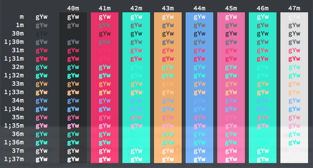
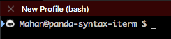

# Panda Syntax for iTerm

An iTerm 2 adaptation of Siamak Mokhtari's [Panda Syntax](https://siamak.github.io/atom-panda-syntax/) theme.



## Installation

- Launch iTerm 2. Get the latest version at [iterm2.com](http://iterm2.com)
- Type CMD+i
- Navigate to "Colors" tab
- Click on the "Color Presets" menu
- Click on "Import…"
- Select the `panda-syntax.itermcolors` file
- Click on the "Color Presets" menu again and select "panda-syntax"

## Command Line Style

Execute the following command in order to apply the panda's customized command line style:
```
$ sudo echo 'export PS1="🐼  \u@\W $ "' >> ~/.bash_profile && source ~/.bash_profile
```

